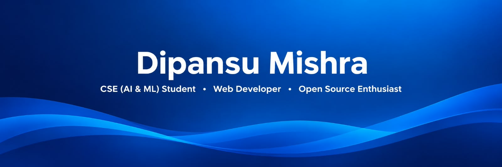

<!-- ================= HEADER ================= -->

  

---

<!-- ================= ABOUT ME ================= -->

<table>
<tr>
<td width="65%" valign="top">

## 👨‍💻 About Me

I'm passionate about web development, AI integration, and building projects that solve real-world problems. I love exploring new technologies and turning ideas into reality.

</td>
<td width="35%" align="center" valign="top">

## 🔗 Connect

  

Let's build something amazing! 🚀

</td>
</tr>
</table>

---

<!-- ================= TECH STACK ================= -->

## 🛠️ Tech Stack

---

<!-- ================= WORKING ON ================= -->

## 🚀 What I'm Working On

<table>
<tr>
<td>

🚆 **Full Stack Railway Website**

Currently developing a full-stack railway website with frontend and backend functionality.

</td>
<td align="center">

🔵 **In Progress**

</td>
</tr>
</table>

- 🤖 **AI Integration** — Exploring AI-powered web applications.
- 🌱 **Open Source** — Learning and exploring open-source contributions.
- 💡 **Student-focused Solutions** — Building ideas that solve real-world problems.

---

<!-- ================= GITHUB STATS ================= -->

## 📊 GitHub Stats

---

<!-- ================= PROJECTS ================= -->

## 📂 Featured Projects

<table>
<tr>
<td width="50%" valign="top">

### 🤖 AI-integration

My first AI integration project.

<a href="https://github.com/dipansumishra9797-sudo/AI-integration">View Project →</a>

</td>
<td width="50%" valign="top">

### 🏏 BCCI-Home-Page

A homepage inspired by the BCCI website.

<a href="https://github.com/dipansumishra9797-sudo/BCCI-Home-Page">View Project →</a>

</td>
</tr>
<tr>
<td width="50%" valign="top">

### 🍽️ Craving-Corner

A restaurant website featuring a menu, food categories, and table booking.

<a href="https://github.com/dipansumishra9797-sudo/Craving-Corner">View Project →</a>

</td>
<td width="50%" valign="top">

### ⚡ Javascript-op

My first JavaScript coding project.

<a href="https://github.com/dipansumishra9797-sudo/Javascript-op">View Project →</a>

</td>
</tr>
<tr>
<td width="50%" valign="top">

### 🇮🇳 Yugantar

A walk through the history of India.

<a href="https://github.com/dipansumishra9797-sudo/Yugantar">View Project →</a>

</td>
<td width="50%" valign="top">

### 🎓 studentOS

A student-focused platform for managing assignments, expenses, notes, timetables, and hostel-related needs.

<a href="https://github.com/dipansumishra9797-sudo/studentOS">View Project →</a>

</td>
</tr>
</table>

---

### 🌟 Keep Learning • Keep Building • Keep Growing 🚀

